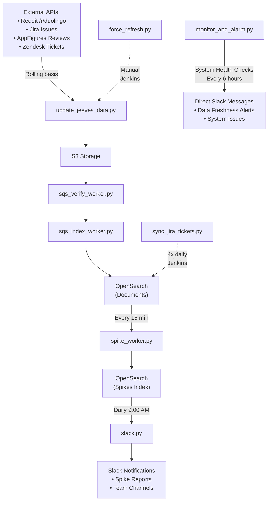

# Jeeves Index Pipeline and Spike Detector

## 🔧 Worker Scripts by Function

### **📥 Data Ingestion**

#### **[`update_jeeves_data.py`](https://github.com/duolingo/duolingo-jeeves/blob/master/jeeves/scripts/index_pipeline_and_spike_detector/update_jeeves_data.py) - Primary Data Ingestion Worker**

- **Purpose**: Pulls data from external sources and populates Jeeves with fresh content
- **Schedule**: Rolling basis - continuously processes data from external sources
- **Infrastructure**: ECS scheduled task ([`s3-worker.json`](https://github.com/duolingo/duolingo-jeeves/blob/master/galaxy/dev/s3-worker.json))
- **Entry Point**: [`crawl_tickets()`](https://github.com/duolingo/duolingo-jeeves/blob/master/jeeves/lib/ticket_crawler.py) from `jeeves.lib.ticket_crawler`

**Data Sources Processed:**

- **Reddit**: Posts from r/duolingo subreddit via OAuth API
- **Jira**: Bug reports and issues via Jira REST API
- **AppFigures**: App store reviews and ratings
- **Zendesk**: Customer support tickets

**Data Flow:**

```
External APIs → Document Validation → S3 Storage → SQS Queue (download_verify_pipeline)
```

**Key Features:**

- **Incremental Updates**: Uses checkpoint system to only fetch new/updated documents
- **Rate Limiting**: Respects API limits for each external source (e.g., Reddit: 200 submissions/hour)
- **Multi-Source Processing**: Handles 4 different data sources with different authentication methods
- **Error Handling**: Continues processing other sources if one fails
- **S3 Organization**: Stores documents in `{DataSource}/{Date}/{DocumentID}` structure

**Monitoring:**

- **ECS Service**: [duolingo-jeeves-s3-worker-prod](https://us-east-1.console.aws.amazon.com/ecs/v2/clusters/prod/services/duolingo-jeeves-s3-worker-prod/health?region=us-east-1)
- **CloudWatch Logs**: [duolingo-jeeves-s3-worker-prod](https://us-east-1.console.aws.amazon.com/cloudwatch/home?region=us-east-1#logsV2:log-groups/log-group/duolingo-jeeves-s3-worker-prod)
- **Grafana Dashboard**: [S3 Worker Monitoring](https://grafana.duolingo.com/d/dafdb59e-36a0-48de-a720-2aea7f9914a6/duolingo-jeeves-prod-s3-worker?orgId=1&refresh=1m)

---

### **🔄 Data Processing Pipeline**

#### **[`sqs_verify_worker.py`](https://github.com/duolingo/duolingo-jeeves/blob/master/jeeves/scripts/index_pipeline_and_spike_detector/sqs_verify_worker.py) - Document Verification Worker**

- **Purpose**: Validates and transforms raw documents from external sources, and functions to fetch additional data for Zendesk and Jira managers
- **Infrastructure**: ECS service (always running)
- **Input**: SQS queue `sqs_download_verify_pipeline`
- **Output**: SQS queue `sqs_verify_index_pipeline`
- **Key Logic**: Calls `manager.process_document()` for each data source type

**Additional Data Fetching:**

- **Jira Documents**: Calls back to Jira API via [`JiraManager`](https://github.com/duolingo/duolingo-jeeves/blob/master/jeeves/manager/jira_manager.py) → [`JiraDAL`](https://github.com/duolingo/duolingo-jeeves/blob/master/jeeves/dal/jira_dal.py) to fetch extra information like `experiment_conditions`
- **Zendesk Documents**: Similarly fetches additional metadata from Zendesk API for tickets
- **Technical Debt**: This data fetching could potentially be moved to the [`update_jeeves_data.py`](https://github.com/duolingo/duolingo-jeeves/blob/master/jeeves/scripts/index_pipeline_and_spike_detector/update_jeeves_data.py) step for better separation of concerns

**Code Flow Example (Jira)**:

```
sqs_verify_worker.py → JiraManager.process_document() → JiraDAL.get_experiment_conditions() → Jira API
```

**Monitoring:**

- **CloudWatch Logs**: [duolingo-jeeves-sqs-worker-1-prod](https://us-east-1.console.aws.amazon.com/cloudwatch/home?region=us-east-1#logsV2:log-groups/log-group/duolingo-jeeves-sqs-worker-1-prod)
- **Grafana Dashboard**: [SQS Worker 1 Monitoring](https://grafana.duolingo.com/d/a0c88716-64fa-463b-abc6-364782f045a5/duolingo-jeeves-prod-sqs-worker-1?orgId=1&refresh=1m)

#### **[`sqs_index_worker.py`](https://github.com/duolingo/duolingo-jeeves/blob/master/jeeves/scripts/index_pipeline_and_spike_detector/sqs_index_worker.py) - Document Indexing Worker**

- **Purpose**: Indexes validated documents into OpenSearch for search functionality
- **Infrastructure**: ECS service (always running)
- **Input**: SQS queue `sqs_verify_index_pipeline`
- **Output**: Documents indexed in OpenSearch
- **Features**: Duplicate detection, batch processing (100 docs/batch)

**Monitoring:**

- **CloudWatch Logs**: [duolingo-jeeves-sqs-worker-2-prod](https://us-east-1.console.aws.amazon.com/cloudwatch/home?region=us-east-1#logsV2:log-groups/log-group/duolingo-jeeves-sqs-worker-2-prod)
- **Grafana Dashboard**: [SQS Worker 2 Monitoring](https://grafana.duolingo.com/d/cb4c8ab7-4e54-4d58-a221-5919f7f36eb5/duolingo-jeeves-prod-sqs-worker-2?orgId=1&refresh=1m)

---

### **📊 Spike Detection & Monitoring**

#### **[`spike_worker.py`](https://github.com/duolingo/duolingo-jeeves/blob/master/jeeves/scripts/index_pipeline_and_spike_detector/spike_worker.py) - Anomaly Detection Worker**

- **Purpose**: Detects statistical spikes in bug reports and user feedback
- **Infrastructure**: ECS scheduled task ([`spike-worker.json`](https://github.com/duolingo/duolingo-jeeves/blob/master/galaxy/dev/spike-worker.json)) - [`rate(15 minutes)`](https://github.com/duolingo/duolingo-jeeves/blob/master/galaxy/prod/main.tf#L393)
- **Algorithm**: Time series analysis with configurable thresholds
- **Output**: Spike detection results for team notifications

**Monitoring:**

- **CloudWatch Logs**: [duolingo-jeeves-spike-worker-prod](https://us-east-1.console.aws.amazon.com/cloudwatch/home?region=us-east-1#logsV2:log-groups/log-group/duolingo-jeeves-spike-worker-prod)

#### **[`monitor_and_alarm.py`](https://github.com/duolingo/duolingo-jeeves/blob/master/jeeves/scripts/index_pipeline_and_spike_detector/monitor_and_alarm.py) - System Health Monitor**

- **Purpose**: Monitors system health and data freshness
- **Trigger**: Manual execution or Jenkins scheduled job
- **Jenkins Job**: [duolingo-jeeves-monitor-and-alarm](https://client-eng-jenkins.duolingo.com/job/duolingo-jeeves-monitor-and-alarm/)
- **Schedule**: [`H */6 * * *`](https://client-eng-jenkins.duolingo.com/job/duolingo-jeeves-monitor-and-alarm/configure) (every 6 hours with randomized minute)
- **Checks**: Worker status, queue depths, data pipeline health
- **Alerts**: System-level issues and performance degradation

#### **[`slack.py`](https://github.com/duolingo/duolingo-jeeves/blob/master/jeeves/scripts/index_pipeline_and_spike_detector/slack.py) - Notification Worker**

- **Purpose**: Sends Slack notifications for spikes and system alerts
- **Infrastructure**: ECS scheduled task (`worker-cron.json`) - `cron(0 9 * * ? *)` (daily at 9:00 AM UTC)
- **Features**: Team-specific routing, escalation logic

**Monitoring:**

- **CloudWatch Logs**: [duolingo-jeeves-worker-cron-prod](https://us-east-1.console.aws.amazon.com/cloudwatch/home?region=us-east-1#logsV2:log-groups/log-group/duolingo-jeeves-worker-cron-prod)

---

### **🛠️ Utility Scripts**

#### **[`force_refresh.py`](https://github.com/duolingo/duolingo-jeeves/blob/master/jeeves/scripts/index_pipeline_and_spike_detector/force_refresh.py) - Complete Data Refresh**

- **Trigger**: Manual execution via [Jenkins job](https://script-runner-jenkins.duolingo.com/job/duolingo-jeeves-refresh-tickets/)
- **Use**: To force refresh all spikes, set the force_spike_refresh_flag to 1 in aws bucket jeeves-document-cache.

---

#### **[`sync_jira_tickets.py`](https://github.com/duolingo/duolingo-jeeves/blob/master/jeeves/scripts/index_pipeline_and_spike_detector/sync_jira_tickets.py) - Jira Data Synchronization**

- **Purpose**: Fetches recently updated Jira tickets and re-indexes them into OpenSearch
- **Trigger**: Manual execution or Jenkins scheduled job
- **Jenkins Job**: [duolingo-jeeves-sync-jira-tickets](https://script-runner-jenkins.duolingo.com/job/duolingo-jeeves-sync-jira-tickets/)
- **Schedule**: [`H 3,9,15,21 * * *`](https://script-runner-jenkins.duolingo.com/job/duolingo-jeeves-sync-jira-tickets/configure) (4 times daily at hours 3, 9, 15, 21 with random minute)
- **Default Window**: 1 hour (configurable via `REFRESH_HOURS` environment variable)

**Key Features:**

- **Incremental Sync**: Only fetches tickets updated since last checkpoint (`-{REFRESH_HOURS}h`)
- **Duplicate Graph Resolution**: Determines parent/child relationships for duplicate tickets
- **Embedding Preservation**: Preserves existing embeddings to avoid recomputation
- **Batch Processing**: Processes tickets in batches of 100 for efficient OpenSearch queries
- **Dev Ticket Detection**: Identifies if tickets are related to development (non-Bug) issues

---

## 🏗️ Architecture Overview



## ⚙️ Infrastructure Mapping

| Script                  | ECS Configuration                                                                                           | ECS Service                                                                                                                                                                                                               | Notes                                    |
| ----------------------- | ----------------------------------------------------------------------------------------------------------- | ------------------------------------------------------------------------------------------------------------------------------------------------------------------------------------------------------------------------- | ---------------------------------------- |
| `update_jeeves_data.py` | [`s3-worker.json`](https://github.com/duolingo/duolingo-jeeves/blob/master/galaxy/dev/s3-worker.json)       | [duolingo-jeeves-s3-worker-prod](https://us-east-1.console.aws.amazon.com/ecs/v2/clusters/prod/services/duolingo-jeeves-s3-worker-prod/health?region=us-east-1)                                                           | Primary data ingestion                   |
| `sqs_verify_worker.py`  | [`sqs-worker-1.json`](https://github.com/duolingo/duolingo-jeeves/blob/master/galaxy/dev/sqs-worker-1.json) | [duolingo-jeeves-sqs-worker-1-prod](https://us-east-1.console.aws.amazon.com/ecs/v2/clusters/prod/services/duolingo-jeeves-sqs-worker-1-prod/health?region=us-east-1)                                                     | Document verification                    |
| `sqs_index_worker.py`   | [`sqs-worker-2.json`](https://github.com/duolingo/duolingo-jeeves/blob/master/galaxy/dev/sqs-worker-2.json) | [duolingo-jeeves-sqs-worker-2-prod](https://us-east-1.console.aws.amazon.com/ecs/v2/clusters/prod/services/duolingo-jeeves-sqs-worker-2-prod/health)                                                                      | OpenSearch indexing                      |
| `spike_worker.py`       | [`spike-worker.json`](https://github.com/duolingo/duolingo-jeeves/blob/master/galaxy/dev/spike-worker.json) | [duolingo-jeeves-spike-worker-prod](https://us-east-1.console.aws.amazon.com/ecs/v2/clusters/prod/scheduled-tasks/duolingo-jeeves-spike-worker-prod?region=us-east-1&selectedTarget=terraform-20210408232715376500000001) | Spike detection (scheduled task, 15 min) |
| `slack.py`              | [`worker-cron.json`](https://github.com/duolingo/duolingo-jeeves/blob/master/galaxy/dev/worker-cron.json)   | [duolingo-jeeves-worker-cron-prod](https://us-east-1.console.aws.amazon.com/ecs/v2/clusters/prod/scheduled-tasks/duolingo-jeeves-worker-cron-prod?region=us-east-1&selectedTarget=terraform-20200701172814811300000002)   | Notifications (daily at 9:00 AM UTC)     |

## 🔍 Monitoring & Troubleshooting

### **Key Metrics to Monitor:**

- **Data Freshness**: Last successful run of `update_jeeves_data.py`
- **Queue Depths**: SQS queue backlog sizes
- **Processing Rate**: Documents processed per minute by each worker
- **Error Rates**: Failed API calls, validation errors, indexing failures

### **Common Issues:**

- **Rate Limiting**: External API limits exceeded
- **Authentication**: Expired tokens or credentials
- **Queue Backlog**: Processing slower than ingestion
- **OpenSearch Issues**: Index capacity or circuit breaker problems

### **Log Locations:**

- **Data Ingestion**: [duolingo-jeeves-s3-worker-prod CloudWatch Logs](https://us-east-1.console.aws.amazon.com/cloudwatch/home?region=us-east-1#logsV2:log-groups/log-group/duolingo-jeeves-s3-worker-prod)
- **SQS Workers**: `/aws/ecs/duolingo-jeeves-sqs-worker-{1,2}`
- **Spike Detection**: `/aws/ecs/duolingo-jeeves-spike-worker`

### **Environment Setup:**

Ensure these environment variables are set:

- `JIRA_API_TOKEN`, `JIRA_USERNAME`
- `REDDIT_CLIENT_ID`, `REDDIT_SECRET_TOKEN`, `REDDIT_USERNAME`, `REDDIT_PASSWORD`
- `ZENDESK_USER`, `ZENDESK_TOKEN`
- `APPFIGURES_USER`, `APPFIGURES_KEY`
